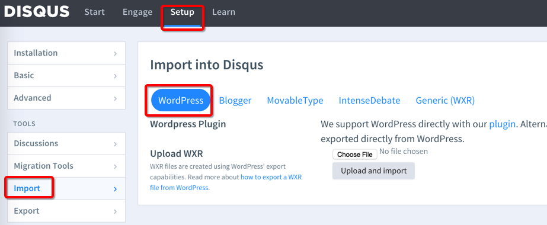

# duoshuo2disqus

# 背景 #

前几天我受够了多说的各种漏洞和问题，终于把评论系统切换到了 Disqus。为了尽可能的保留之前网友们的留言和评论，我写了个 Python 程序把多说导出的 JSON 格式文件转换成了 Disqus 支持的 WXR (WordPress eXtended RSS) 格式。

对切换评论系统的前因后果以及中间过程感兴趣的话，可以看看我之前的博文《[告别多说，拥抱 Disqus](http://blog.jamespan.me/2015/04/18/goodbye-duoshuo/)》。

可以访问我的博客原文《[我把博客评论从多说迁移到 Disqus 时造的轮子](http://blog.jamespan.me/2015/04/21/the-duoshuo-migrator/)》参与讨论。

# 轮子 #

代码明显属于糙快猛的风格，没有太多的讲究，能把活干好就行。好像自从我大学时期读了垠神的这篇 《[谈程序的“通用性”][1]》 之后，写出的脚本和一次性轮子都是这种风格。

# 用法 #

1. 下载 [duoshuo-migrator.py](./duoshuo-migrator.py?raw=true)，并安装依赖

    ```bash
    pip install lxml
    ```

2. 登录多说后台，在`http://<shortname>.duoshuo.com/admin/tools/` 页面导出多说评论
    
3. 使用`duoshuo-migrator.py`将步骤 2 导出的评论转为 [disqus 支持的 XML](https://help.disqus.com/customer/portal/articles/472150-custom-xml-import-format) 格式的文件。 
    `duoshuo-migrator.py`有三个参数：
    * `-h` 查看帮助
    * `-i` 指定输入文件，默认从 stdin 读取，
    * `-o` 指定输出文件，默认输出到 stdout。

    一般可以这么用：

    ```
    python duoshuo-migrator.py -i ~/Desktop/export.json  -o disqus.xml
    ```

    如果程序执行的过程中发现有文章的标题为空，会往 stderr 中输出一些信息来提醒用户注意，比如这样：

    > found article without title, id=1173938669371785301, link=http://www.jamespan.me/blog/2015/01/22/trick-of-paging-query/

4. 登录 disqus 后台，在`https://<shortname>.disqus.com/admin/discussions/import/platform/wordpress/` 页面选择步骤 3 中导出的`xml`文件
        

# 最后 #

我对 lxml 库不是很熟悉，所以写生成 XML 那段代码还是颇费了一番功夫，写这种代码真是磨性子。

希望我顺手造的轮子能在你逃离多说拥抱 Disqus 的时候，帮你减少麻烦节省时间，也希望我的贡献让这个世界稍微变得美好了那么一点点~

# 参考 #

- [Importing your old comments to Disqus site](http://agiliq.com/blog/2015/01/importing-your-old-comments-to-disqus-site/)

[1]: http://www.yinwang.org/blog-cn/2013/04/13/generality/
